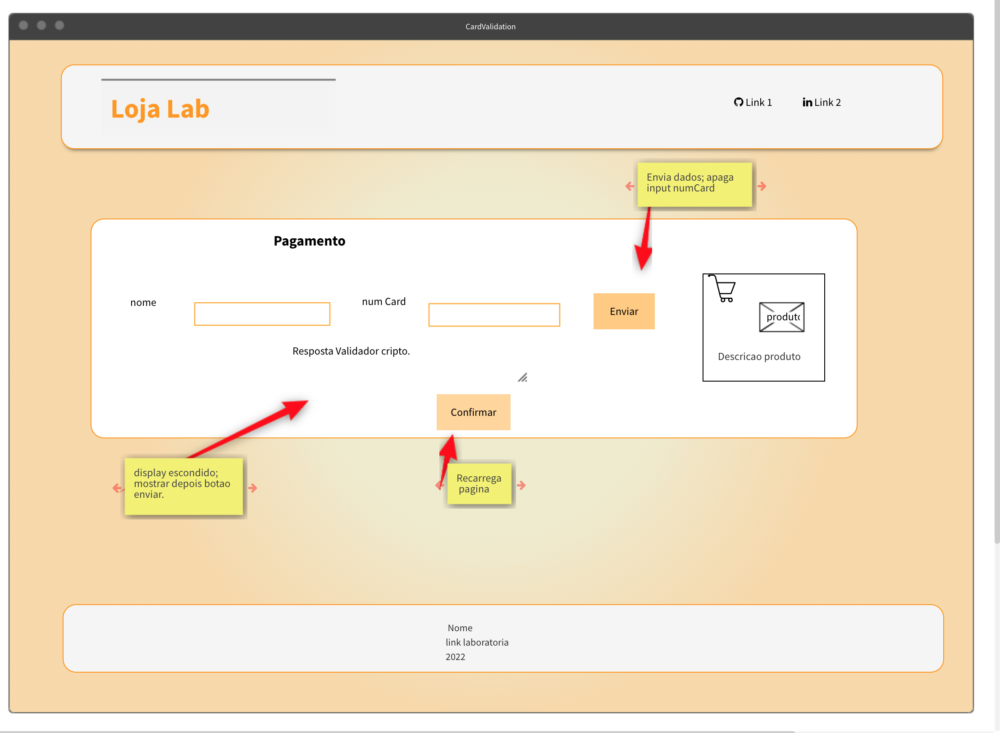
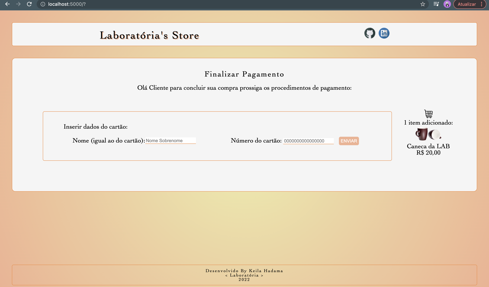

# Card Validation 
=================
  
 Aplicativo Web que permite ao usuário validar um cartão de crédito
 :credit_card:. 
Projeto #1 do Bootcamp Laboratória
  

## Índice
=================
  <!--ts-->
  - [1. Introdução](#1-Introdução)
  - [2. Instalação](#2-Instalação) 
  - [3. Testes](#3-Testes)
  - [5. Tecnologias](#5-Tecnologias)
  - [6. UX](#6-UX)
  - [7- Demonstração da aplicação](#7-Demonstração-da-aplicação) 
  <!--te-->

## 1-Introdução
  
 O objetivo deste projeto é permitir que o usuário valide um cartão de crédito e tenha as funcionalidades de ocultar os dígitos do cartão exceto os 4 últimos.

  
  A Validação é feita pelo [algoritmo de Luhn](https://en.wikipedia.org/wiki/Luhn_algorithm), ou módulo 10, é um método utilizado para validar desde números de IMEI de celular, números de identificação até cartões de crédito entre outros. Este algoritimo funciona desta maneira:  return
    - Obtemos o inverso do número a ser verificado (contendo apenas dígitos [0-9]);
    - Os números que ocupam uma posição par são multiplicados por dois;
    - Se esse número for maior ou igual a 10, os dígitos são somados e substituem a posição par; 
    - O número final a ser verificado é a soma de todos os dígitos e este será válido se for um múltiplo de 10.
    
  
 A ideia do produto foi uma página de pagamento de um ecommerce. Onde os usuários do produto são possíveis clientes. O objetivo do usuário é finalizar uma compra e para isso ele precisa inserir seus dados, inclusive os dados de cartão de crédito para a validação, assim que validado seria possível continuar a navegação

 
 
  
## 2-Instalação 
  
Para instalar e executar este projeto siga os seguintes passos:

   1. Se assegure de ter um editor de texto como [Code](https://code.visualstudio.com/); 
   2. Tenha um terminal e `git` instalados;
   3. Faça o `fork` deste repositório;<
   4. Faça o `clone` para sua maquina local;
   5. Instale o [Node.js](https://nodejs.org/)
   6. Com o comando `npm install` no terminal instale as dependências do projeto;
   7. Para visualizar o programa no navegador use o comando `npm start` no terminal para abrir um servidor web local e entre na `url` indicada `http://localhost:5000` no seu navegador;
   8. Para fazer os `testes` unitários execute o comando `npm test`no terminal.

## 4-Testes
   Os testes deste projeto já vieram prontos do boilerplate do repositório inicial. Estão inclusos o [eslint](https://eslint.org/) para o `JavaScript` e para o `HTML` [htmlhint](https://github.com/yaniswang/HTMLHint). Essas tarefas são executadas com o comando `npm run test`.
   Os requisitos exigidos para passar nos testes unitários foram cobrir no mínimo de 70% dos _statements_, _functions_
   e _lines_, e um mínimo de 50% de _branches_.
   Neste projeto os seguintes resultados foram obtidos:
   

## 5-Tecnologias
   
   
   

## 6-UX
  
 O design da experiência do usuário foi primeiro pensada e desenhada em papel. Após alguns ajustes o protótipo final foi passado ao [mockflow](https://wireframepro.mockflow.com/space/M8Vop87trnb). O maior desafio desta etapa foi conhecer esta ferramenta nova e tentar replicar o que foi pensado. 

  

## 7- Demonstração da aplicação
  
 
 

## Status

  
Projeto finalizado
 :white_check_mark:

### Licença 

  

# Autora

  
  Desenvolvido por Keila pelo Bootcamp da Laboratória.

  

  
